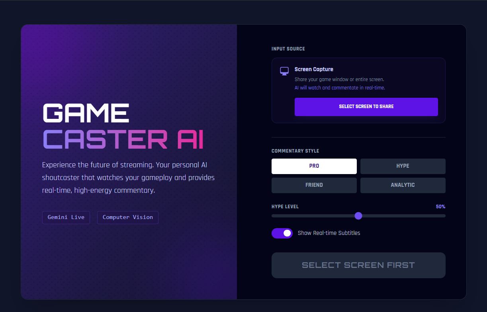
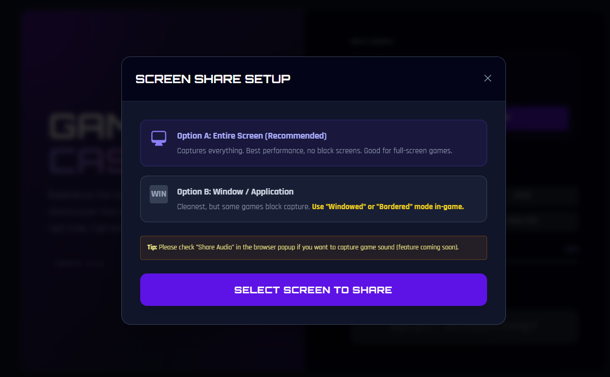
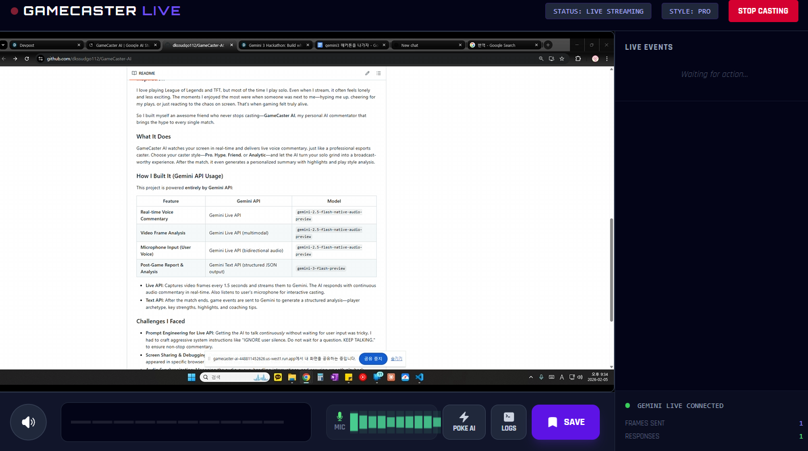

# GameCaster AI: HypeStream

**Turn your gameplay into a live broadcast with real-time AI commentary that feels the hype with you.**

## About the Project

### Inspiration

I love playing League of Legends and TFT, but most of the time I play solo. Even when I stream, it often feels lonely and less exciting. The moments I enjoyed the most were when someone was next to me—hyping me up, cheering for my plays, or just reacting to the chaos on screen. That's when gaming felt truly alive.

So I built myself an awesome friend who never stops casting—**GameCaster AI**, my personal AI commentator that brings the hype to every single match.

### What It Does

GameCaster AI watches your screen in real-time and delivers live voice commentary, just like a professional esports caster. Choose your caster style—**Pro**, **Hype**, **Friend**, or **Analytic**—and let the AI turn your solo grind into a broadcast-worthy experience. After the match, it even generates a personalized summary with highlights and play style analysis.

<figure style="display:inline-block; width:32%; text-align:center;">

 <em>Choose your caster style</em>
</figure>
<figure style="display:inline-block; width:32%; text-align:center;">

 <em>Setting up screen share</em>
</figure>
<figure style="display:inline-block; width:32%; text-align:center;">

 <em>Live AI commentary in action</em>
</figure>

### How I Built It (Gemini API Usage)

This project is powered **entirely by Gemini API**:

| Feature | Gemini API | Model |
|---------|------------|-------|
| **Real-time Voice Commentary** | Gemini Live API | `gemini-2.5-flash-native-audio-preview` |
| **Video Frame Analysis** | Gemini Live API (multimodal) | `gemini-2.5-flash-native-audio-preview` |
| **Microphone Input (User Voice)** | Gemini Live API (bidirectional audio) | `gemini-2.5-flash-native-audio-preview` |
| **Post-Game Report & Analysis** | Gemini Text API (structured JSON output) | `gemini-3-flash-preview` |

- **Live API**: Captures video frames every 1.5 seconds and streams them to Gemini. The AI responds with continuous audio commentary in real-time. Also listens to user's microphone for interactive casting.
- **Text API**: After the match ends, game events are sent to Gemini to generate a structured analysis—player archetype, key strengths, highlights, and coaching tips.

### Challenges I Faced

- **Prompt Engineering for Live API**: Getting the AI to talk *continuously* without waiting for user input was tricky. I had to craft aggressive system instructions like "IGNORE user silence. Do not wait for a question. KEEP TALKING." to ensure non-stop commentary.
- **Screen Sharing & Debugging**: Debugging screen capture and media stream handling was painful—issues only appeared in specific browser contexts, and logs were hard to trace in real-time streaming scenarios.
- **Audio Synchronization**: Managing the audio queue, handling interruptions, and ensuring smooth playback required careful state management with Web Audio API.

---

## Run Locally

**Prerequisites:**  Node.js

1. Install dependencies:
   `npm install`
2. Set the `GEMINI_API_KEY` in [.env.local](.env.local) to your Gemini API key
3. Run the app:
   `npm run dev`

## Testing Instructions

1. **Select Caster Style**: Choose your preferred commentary style—**Pro**, **Hype**, **Friend**, or **Analytic**. Adjust the **Hype Level** slider and toggle **Subtitles** if desired.

2. **Set Up Screen Share**: Click **"SELECT SCREEN TO SHARE"** and choose your game window or entire screen.
   > ⚠️ **Important**: You **must allow microphone and audio permissions** when prompted. A microphone is required for the AI to start casting.

3. **Start Casting**: Once the preview looks good, click **"START CASTING"**. Play your game normally—the AI will commentate in real-time. Speak into your microphone to interact with the AI caster.

4. **Live Features**:
   - 🔇 **Mute/Unmute**: Toggle AI audio output
   - ⚡ **POKE AI**: Force the AI to speak if it goes silent
   - 📋 **LOGS**: View debug logs for troubleshooting
   - 🔖 **SAVE**: Bookmark a highlight moment

5. **End Session**: Click **"STOP CASTING"** to finish. The AI will generate a **post-game report** with your play style analysis and highlights.
